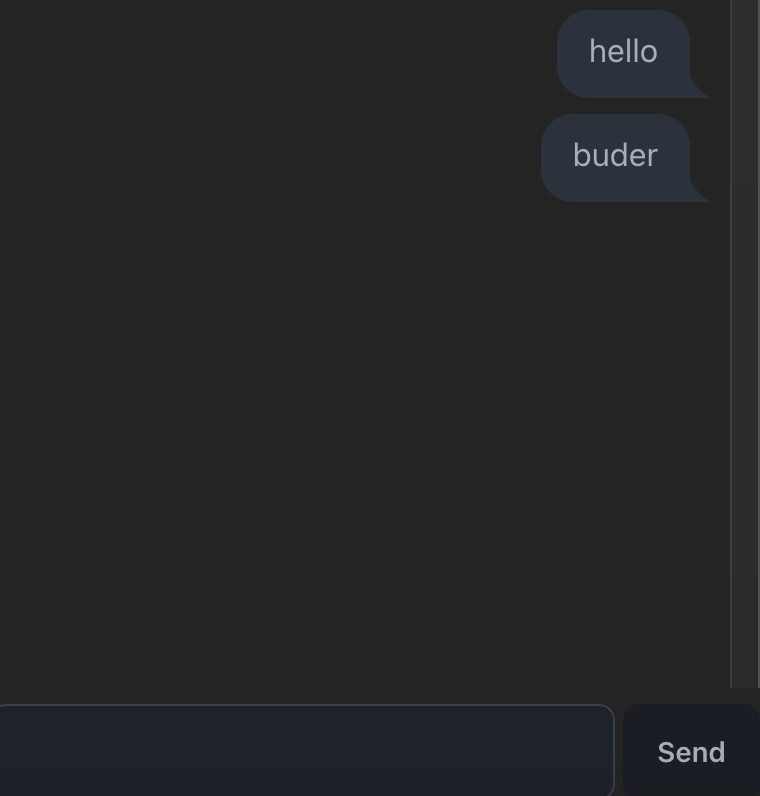

# BudChat

> A example of buder to build a chat app with daisyUI



Core code of showing messages
```typescript
ForEach(
      messages,
      (message) => ChatBubble(message),
      Col()
        .expand.style({ width: percent(100), overflowY: "scroll" })
        .padding(px(8))
    ),
```